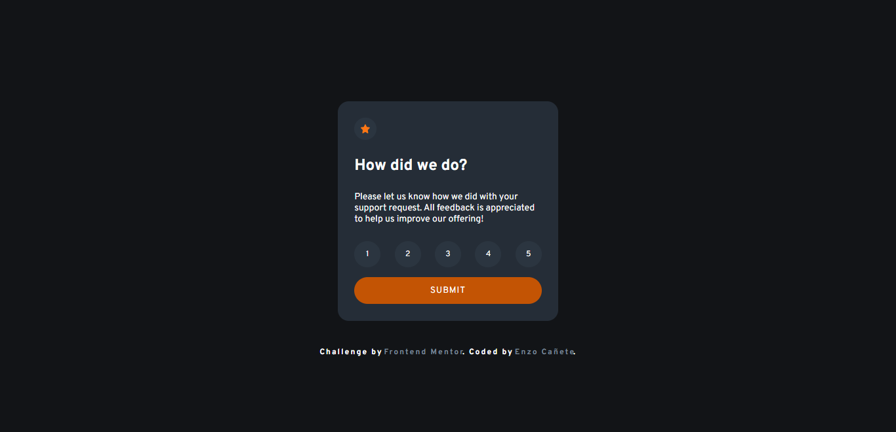

# Frontend Mentor - Interactive rating component solution

This is a solution to the [Interactive rating component challenge on Frontend Mentor](https://www.frontendmentor.io/challenges/interactive-rating-component-koxpeBUmI). Frontend Mentor challenges help you improve your coding skills by building realistic projects. 

## Table of contents

- [Overview](#overview)
  - [The challenge](#the-challenge)
  - [Screenshot](#screenshot)
  - [Links](#links)
- [My process](#my-process)
  - [Built with](#built-with)
  - [What I learned](#what-i-learned)
  - [Continued development](#continued-development)
- [Author](#author)

## Overview

### The challenge

Users should be able to:

- View the optimal layout for the app depending on their device's screen size
- See hover states for all interactive elements on the page
- Select and submit a number rating
- See the "Thank you" card state after submitting a rating

### Screenshot

### Links

-  [Solution Link](https://github.com/EnzoDev10/Interactive-rating-component)
-  [Live Site](https://enzodev10.github.io/Interactive-rating-component/)

## My process

### Built with

- Semantic HTML5 markup
- CSS custom properties
- Flexbox
- Mobile-first workflow
- Less preprocessor

### What I learned

The main thing i learned with this project was how to use forms to change the DOM. This was my first time using forms in any way and it was really interesting to use JavaScript to get the rating given by the user.

### Continued development

I want to keep learning more about JavaScript, it is a really interesting and useful language.

## Author

- Frontend Mentor - [@EnzoDev10](https://www.frontendmentor.io/profile/EnzoDev10)
